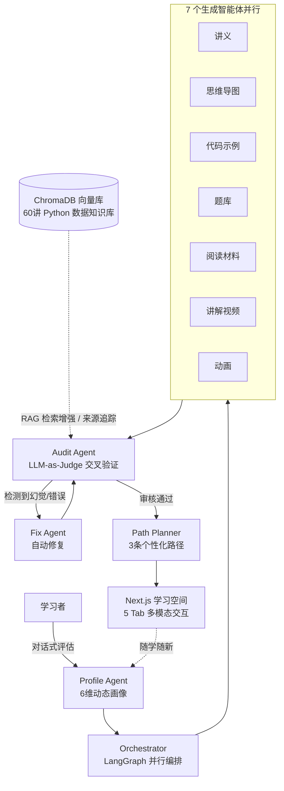

# LearnMate · LearnWeave — 多智能体个性化学习平台

> **Multi-Agent Personalized Learning Platform** — 领域知识自动生成 · 多智能体协同决策 · RAG 反幻觉

[](http://156.239.4.141:3000)


**2026 年度中国青年"揭榜挂帅"擂台赛 · XH-202630**
发榜单位：上海云之脑智能科技有限公司

🔗 **在线演示**：http://156.239.4.141:3000 （测试账号见文末）

---

## 这是什么

一个面向"Python 数据分析"领域的 AI 学习平台：根据学习者的 6 维能力画像，由 **7 个智能体并行生成**讲义、思维导图、代码示例、题库、阅读材料、讲解视频与动画，再由独立的**审核智能体交叉验证**（LLM-as-Judge），发现幻觉自动修复后重审，最终为不同基础的学习者规划 3 条差异化学习路径。

**核心闭环**：学情诊断 → 知识生成（7 Agent 并行）→ 内容审核（交叉验证）→ 修复重审 → 个性化路径 → 动态迭代

## 架构



## 技术栈

| 层 | 技术 |
|---|---|
| 后端 | Python 3.11 · FastAPI · uvicorn · LangGraph |
| 前端 | Next.js (App Router) · TypeScript · pnpm · shadcn/ui |
| 大模型 | 8 家 LLM 统一适配（讯飞星火 / DeepSeek / Qwen / GLM / Moonshot / OpenAI / Ollama / Groq），3 次重试 + 指数退避 |
| 检索增强 | ChromaDB · TF-IDF 双路混检 · 引用来源可追溯 |
| 多模态 | 讯飞星火 TTS / VMS 虚拟人 · 视频生成 · LaTeX / 思维导图渲染 |
| 部署 | Docker · docker-compose |

## 技术亮点（面试可讲）

- **多智能体协同决策闭环**：`VerificationOrchestrator` 实现 Generate → Audit → Fix → Re-audit → Decide 全流程，生成质量由独立审核 Agent 把关，而非生成者自评。
- **交叉验证防幻觉**：独立 AuditAgent 校验知识准确性，LLM-as-Judge 自动打分，问题内容自动进入修复队列重审，而非直接放行。
- **LangGraph 并行扇出**：7 个生成 Agent 并行执行，整体延迟 ≈ 单个最慢 Agent，而非串行叠加。
- **多 LLM 提供商抽象**：统一接口一键切换 8 家模型，业务代码与供应商解耦。
- **RAG 反幻觉辅导**：Tutor Agent 基于 ChromaDB 检索到的 60 讲知识库作答，答案附来源引用。
- **可观测性**：Agent 协同全过程可追溯，学情仪表盘 + 知识点掌握度热力图 + 计划调整时间线。

## 快速启动

### 环境要求
- Python 3.11+ / Node.js 18+ / pnpm

### 1. 配置密钥
复制 `.env.example` 为 `backend/.env`，填入你的 LLM 密钥（支持上述任一提供商）：

```env
LLM_PROVIDER=deepseek
LLM_MODEL=deepseek-chat
DEEPSEEK_API_KEY=sk-your-key
```

### 2. 启动

```bash
# 后端
cd backend
pip install -r requirements.txt
python -m uvicorn app.main:app --port 8002

# 前端
cd frontend
pnpm install
pnpm dev
```

浏览器打开 `http://localhost:3000`

## 测试账号

| 账号 | 密码 | 画像 | 六维均分 |
|---|---|---|---|
| learner_a | 123456 | 零基础转行者 | 27 |
| learner_b | 123456 | 计算机专业学生 | 72 |
| learner_c | 123456 | 在职数据分析师 | 86 |

## 验证结果（3 组差异化学习者）

| 学习者 | 画像特征 | 推荐路径 | 难度匹配度 |
|---|---|---|---|
| learner_a（零基础） | 全维度薄弱 | 全维度补基础 | > 85% |
| learner_b（计算机） | 编码强 / 实践弱 | 主攻实践 + 数据清洗 | > 88% |
| learner_c（分析师） | 全面均衡 | 机器学习 + 部署拓展 | > 90% |

## 项目结构

```
├── backend/app/
│   ├── agents/
│   │   ├── unified_orchestrator.py      # 7 Agent 并行编排
│   │   ├── verification_orchestrator.py # 多 Agent 交叉验证闭环
│   │   ├── audit_agent.py               # 内容审核 Agent
│   │   ├── profile_agent.py             # 学情诊断 Agent
│   │   └── tutor_agent.py               # RAG 反幻觉辅导
│   ├── routers/                         # REST API
│   ├── core/                            # LLM 客户端 / 安全 / 事件总线
│   └── services/                        # TTS / 题库 / 验证
├── frontend/
│   ├── app/learn/[id]/                  # 学习空间（5 Tab 多模态）
│   ├── app/profile/                     # 学情画像
│   ├── app/assessment/                  # 效果评估
│   └── app/teacher/                     # 教师管理端
└── knowledge-base/                      # Python 数据分析知识库（60 讲）
```

---

*本仓库为竞赛项目代码，API 密钥请自行配置，不包含在内。*
